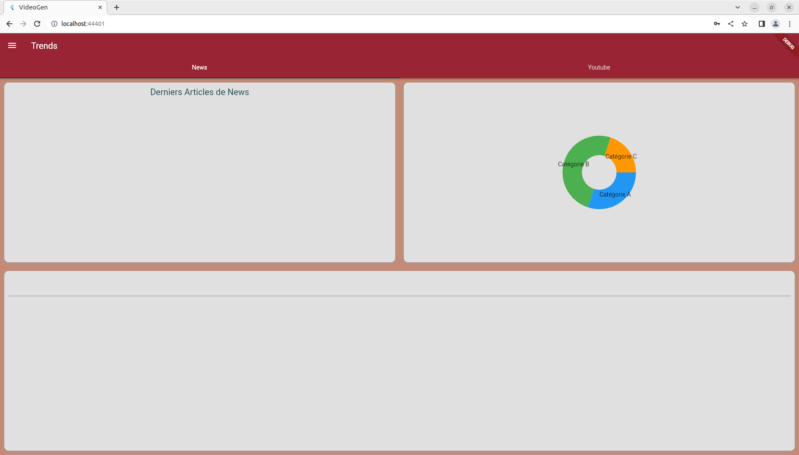
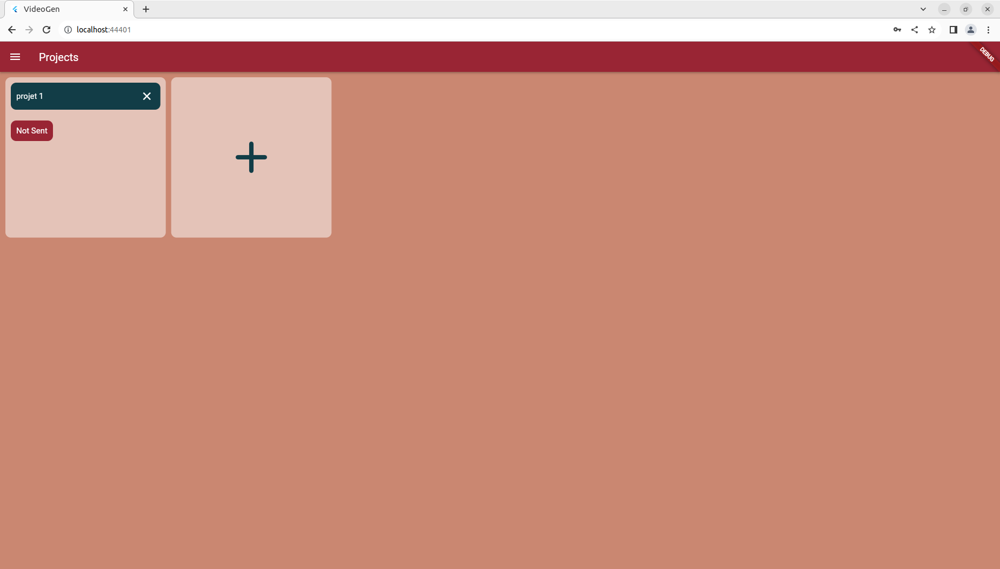
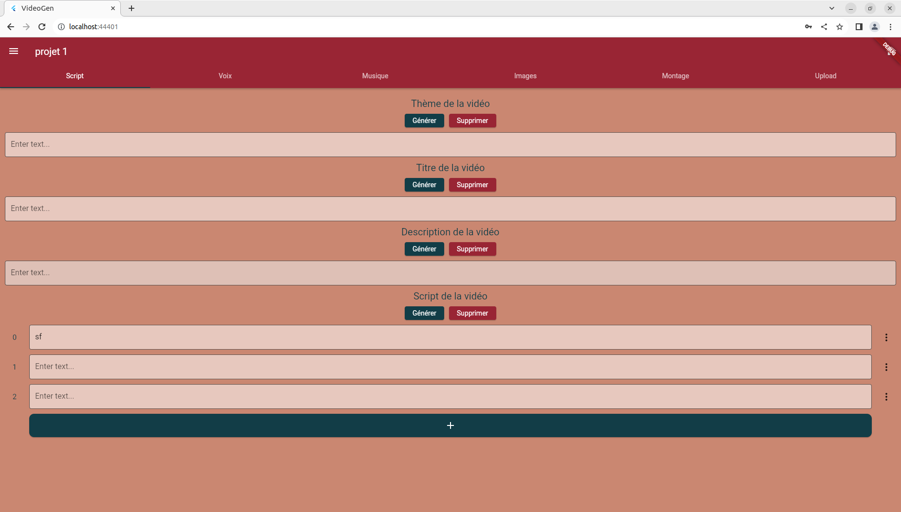
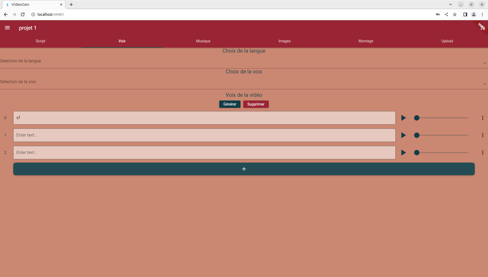
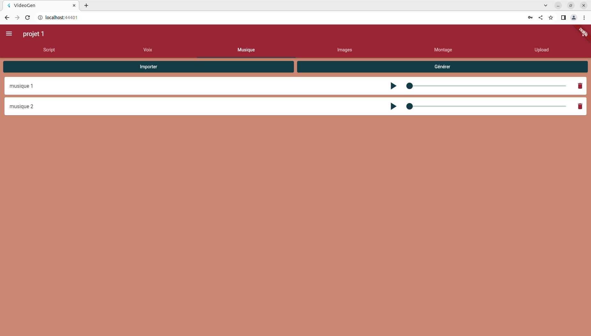
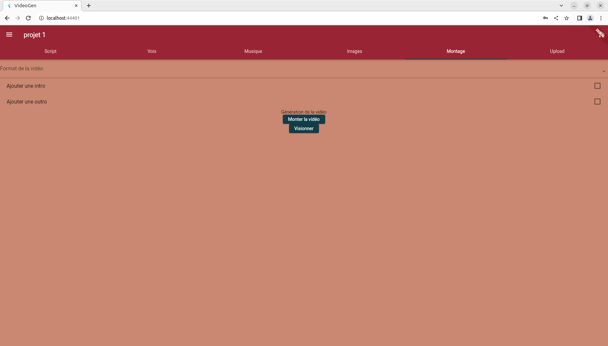
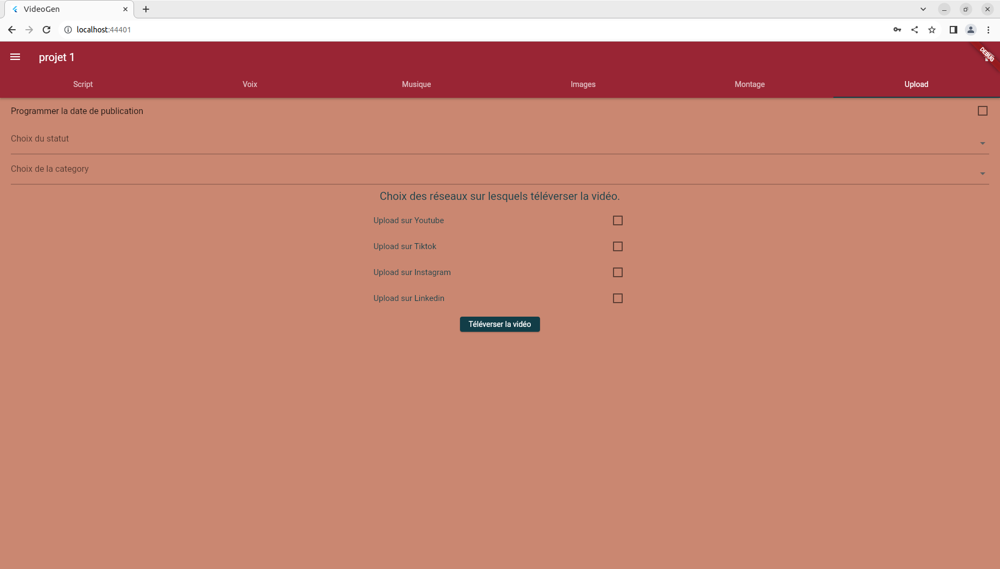

# VideoGen: Web interface for analysis, production, publication, performance evaluation for social media video content

## Présentation
VideoGen is a comprehensive web interface designed to streamline the entire process of managing and optimizing social media video content. This multifaceted platform provides a wide range of functionalities, encompassing the analysis of press articles, keyword evaluation, SEO indicators, script generation, voice generation, music generation, image generation, 3D animation creation, meta-avatar generation, and the setup of advertising campaigns. Additionally, VideoGen offers in-depth analysis tools for assessing the performance of media content across various social media platforms, and it simplifies the management of multiple accounts. With VideoGen, users can efficiently produce, publish, and evaluate the effectiveness of their social media video content.

## Usage
VideoGen improves inbound marketing for web product sales by simplifying content creation, optimizing SEO, streamlining campaign management, offering performance analysis, saving time and resources. It allows businesses to engage their target audience more effectively.

## Prerequisites
- Flutter
- Anaconda
- PostgreSQL database

## Future features
- Web Interface Creation
- Main API Development
- Music Generation
- Integration with Various Media Platforms
- Trends Tracking
- SEO Indicator Creation
- 3D Scene Generation
- 3D Rendering API
- Face Animation
- Docker Environment Setup
- Performance Analysis
- Marketing Campaign Creation

## Screenshot

### Trends

### Projects

### Script

### Voice

### Music

### Images

### Video Editing

### Upload

